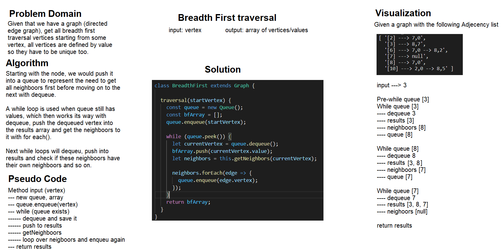

# Graph Methods BFT
Graphs are the way to map non linear data, they represent the connectivity of seemingly isolated but related data points.

# Class-36
# Breadth-first traversal
## Challenge Description
The graph, similar to tree's could have both breadth-first traversal and depth-first traversal, the former is going to be implemented to one type of graphs which is directed. BFT means getting all neighbors visited before knocking on their neighbors. 

## Approach & Efficiency
Now knowing BFT from past lab of tree's methods:
- For undirected edge graphs, we then could implement a better way of doing a check using the hashtable, since we are limited by the possibility of infinite looping
- With directed edge it is much easier and involves queue all neighbors, and dequeue one at a time and enqueue all of its neighbors again.

Both implementations have a time complexity of O(n) since the first cuts time short with hashtable storage, but because of that the undirected has O(n^2) of double storage worst case scenario, given that both visited nodes and queued nodes needs to be stored, otherwise with directed its just O(n) space complexity.

## Solution
