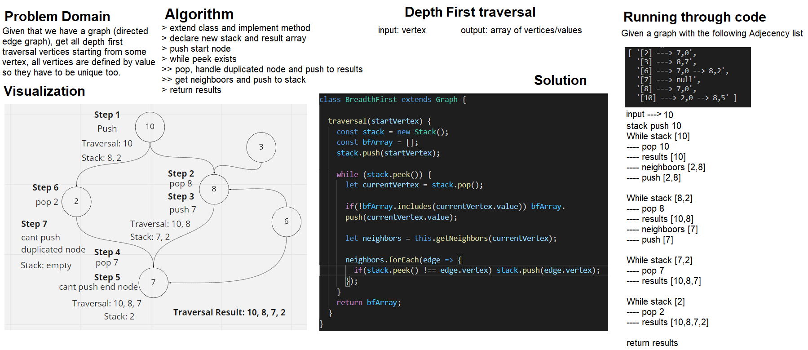

# Graph Methods DFT
Graphs are the way to map non linear data, they represent the connectivity of seemingly isolated but related data points.

# Class-38
# Depth-first traversal
## Challenge Description
The graph, similar to tree's could have both breadth-first traversal and depth-first traversal, the former is going to be implemented to one type of graphs which is directed. DFT means getting the farthest connected nodes first, then back to the previous node and check their farthest again. 

## Approach & Efficiency
Now knowing DFT from past lab of tree's methods:
- For undirected edge graphs, we then could implement a better way of doing a check using the hashtable, since we are limited by the possibility of infinite looping
- With directed edge it is much easier and involves pushing all neighbors, and pop then push the popped neighbors again. Due to FILO structure we automatically go through all nodes, starting from the the root to farthest and back.

Both implementations have a time complexity of O(n) since the first cuts time short with hashtable storage, but because of that the undirected has O(n^2) of double storage worst case scenario, given that both visited nodes and pushed nodes needs to be stored, otherwise with directed its just O(n) space complexity.

## Solution
