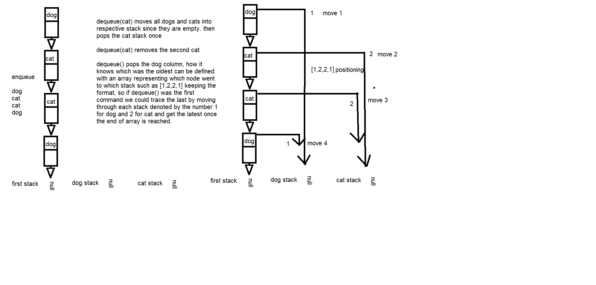

# Fifo Animal Shelter 
Another iteration of queues with stacks is a special categorization of input.

# Class-11
## Challenge Description
This challenge makes use of the last queue with stacks lab, in addition of additional stack to help categorize cats and dogs, in addition to getting the oldest entry when none specified with dequeue.

## Approach & Efficiency
The approach would is similar, with additional stack so they would be three total. The first keeps all enqueue values in it, the second and third is triggered by a dequeue, depending on the specified `dog` or `cat` input, or the oldest entry which would be the bottom of the first stack. Approach Efficiency is a O(1) for enqueue and O(n) for a specific dequeue assuming worst empty operation, and O(n) for the unspecified oldest dequeue.

## Solution
