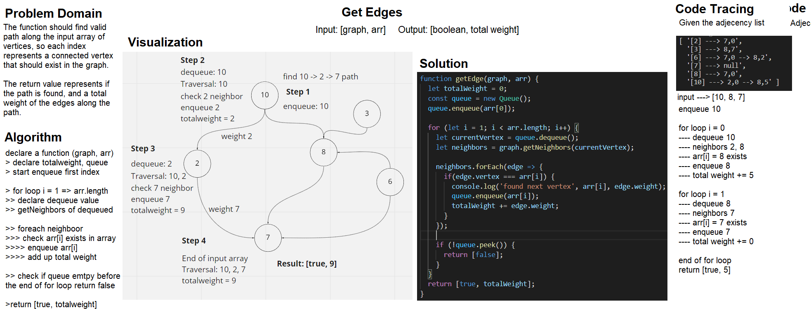

# Get Edges in Graphs
Check out neighbors for all input array to see if a direct edge exists between all of the input array.

# Class-37
# Get Edges
## Challenge Description
Given that we have an array of city names, and a graph representing the cities and their direct path of flight (edge) along with the price (weight). Check all valid direct paths that exists between any input name array.

## Approach & Efficiency
The problem looks simple at first look, but there is hidden complexity as soon as there are more than two inputs, what is needed is to check if a flight connects from one node, all the way through the other nodes in the input array.

Starting with the assumption that input array is directed, as each index is connected to the next for simplicity. One way is to simply follow the directed edge path, and see if one of the cities left in the array exists there, if not return that there is a disconnect `false` and continue until the end of the array is reached, and `true` is returned.

If we need to find from a combination of all input array in any order, a new loop is needed to go through each input array once, and check for neighbors as usual with the rest of the input until the end of array is reached, doubling the time needed to go through.

The time complexity represents going through all of the available nodes, assuming the input is equal to the graph size, which is O(n), since in directed edge we don't revisit any node.
Space complexity is O(1) with no extra storage used, other than for the input.

The other undirected edge involves a hashtable to exclude the visited nodes, and make sure no circular pattern happens, thus increasing the space complexity to O(n) on the worst case scenario. 

The last undirected edge case, and any combination input array makes it a complex problem involving both O(n^2) for time and O(n) for space.

## Solution
