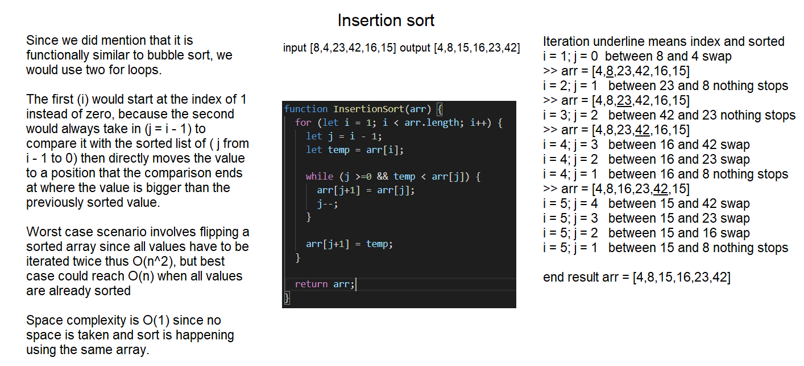

# Insertion Sort 
Sorting algorithms to sort numbers.

# Class-26
## Challenge Description
Insertion sort, similar to bubble sort if you are familiar with it, takes into account each value and compares it to the rest of the array input, starting with the bottom smallest object and building up the sorted array. Which does make it sound exactly like the opposite of bubble sort, where the greatest value is pushed to the end instead.

The main difference is that it stops right at the moment it sees that the previous index is smaller, since we sort upwards from 0th index, making best case scenario O(1).

## Solution
