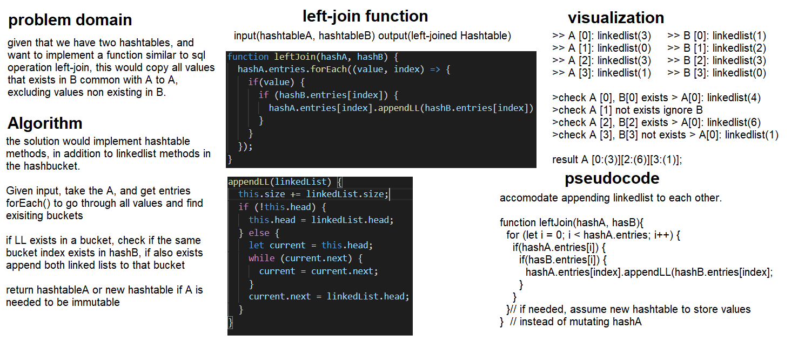

# Left Join Algorithm
Using two hashtables to do a similar operation available in SQL and data analysis of joining to the left one.

# Class-34
## Challenge Description
This challenge is about merging two hash-tables to get the values that exists in the left, and corresponding values from the right, excluding any values that only exist in the right.

## Approach & Efficiency
The approach would consider the length of the linkedlist in a bucket of the left, when I'd do merge to the it, if the linked list exists it also means that its 99% the same key that I want, thus merging should continue.

The for loop checks for all indices in the left hashtable, and applies the same values indices in the right, and checks if it exists, if it does then append and merge both linked lists, if not add a null value node.

The approach could be reversed by reversing the start, where the check is for the right now. Time complexity is about O(n), where average, best and worst goes through the whole hashtable in a loop. Space complexity is however a O(1) since the operation is within either hashtables and no extra space is taken.

To do right join, its possible to swap positions and still call left join, since they are basically the same but flipped in where to add the common values.

## Solution
