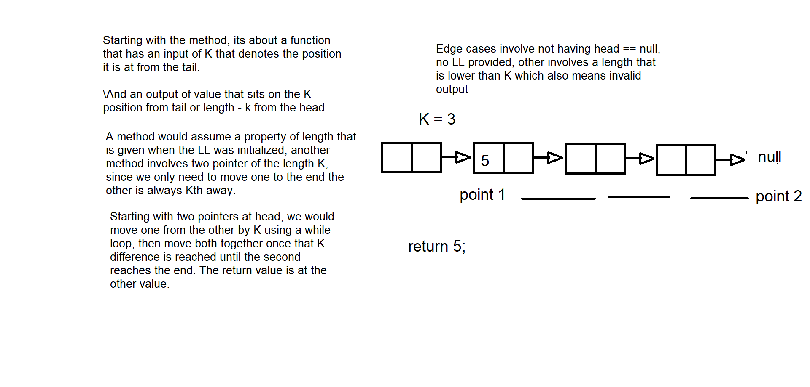

# Linked-list functions
Linked lists are such nested objects that points to each others, multiple implementations of such concept is done for a linear linked as a start is done in this challenge.

# Class-07
## Challenge Description
This challenge makes use of previous methods to apply the method of getting the value from kth index of the end.
The method simply takes in a single input denotes how far is the end from that value.

## Approach & Efficiency
The approach would consider the length of the linkedlist, and reach the value denoted by k after length - k;
Assuming we know the length since initialization of the LL as a property, the time complexity should be O(n) with a worst case loop, and O(1) for space complexity since we are returning a single value. 

## Solution

# Class-06
## Challenge Description
The challenge involves applying 3 methods, an append() and both insertBefore() and insertAfter() values.

## Approach & Efficiency
First method is similar to the previous lab insert(), with a loop, second method and third methods are also similar, and all three have a loop, thus time complexity is O(n).

## Solution
append() has a trivial solution and only looks at the end of the LL, insertBefore and insertAfter have the same method except for the if statement check, before would check the nextValue if its equal to our parameter, after would check for the current value instead, both would assume the current to be the node, and node.next to point to the current.next.

# Class-05
## Challenge Description
The challenge involves applying 3 methods, an insert() with O(1) time complexity, an includes() that checks for a value, and finally a toString() that prints out the whole linked list as values with arrows.

## Approach & Efficiency
First method initializes with head and tail properties, adding to tail directly and moving tail to that value allows for O(1) time complexity.
Second method would include if statement check with node loop.
Third method loops and concat.

## Solution
A starter approach is to define a class for each node wit properties of value and next, and a linked list class that has the properties of head and tail (for reduced time complexity when inserting).

First method implements a new linkedList, define first element as head, then work its way down by appending to tail with the latest input, and redefine tail as that input, this allows for O(1) time complexity.

Second method checks for the whole array using a while loop that checks for .next, then checks for its value and then move to the next node to do the same till the end, returns true for match or false for no match.

Third method concatenates the the output with a string as it loops through each node, and ends with a null concatenate, then outputs the string. 
