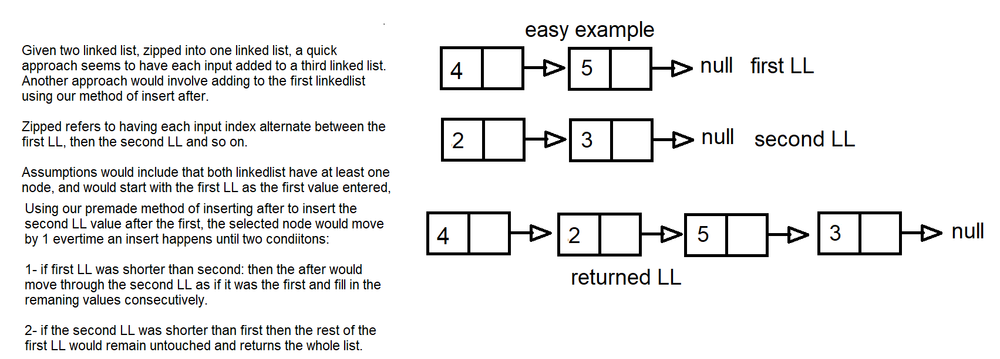

# Zipped List functions
Linked lists are combined in a zip like way that each input alternates into the output in an equal way, unless one LL is longer than the other.

# Class-08
## Challenge Description
This challenge offers some utility to the methods defined in LL file to solve the problem of zipping LL together.
Two linked lists are taken in as an argument, and the output has these two merged in a zipped fashion.

## Approach & Efficiency
The approach would consider the need to add a third linked list, but since we are trying for a space complexity of O(1), we could not increase the existing memory usage and have to utilize existing variables, this is possible using a method of insertAfter() from our defined class of LL.

## Solution

