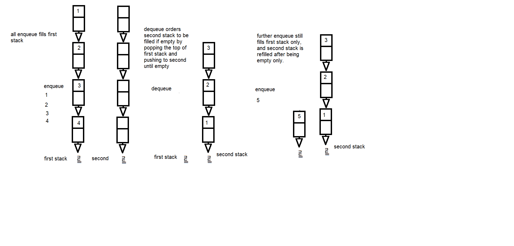

# Queues from two stacks data structure classes
Linked lists is now becoming a stack, and two stacks are ending up as Queues, how entangled can DSA get? 

# Class-011
# Queue with Stacks
Implementing a pseudo queue classes to use in the future, all functionalities must adhere to the correct intended use.

## Challenge
Using only two stacks and their methods, implement a queue that also has enqueue and dequeue expected methods.

## Approach & Efficiency
Now this challenge is possible since FILO + FILO is either a FIFO or LILO depending on when the first stack is emptied to the second, is it at the insertion or deletion method? 

The first stack could have all the enqueue, and would empty the values into the second as soon as the dequeue is called once. This makes what was First In Last Out into First In First Out since the first value which was last in the first stack, became the first value again at the second stack.

This makes enqueue and dequeue a time complexity of O(1), O(n) and space complexity of both O(n). Its possible to reverse the time complexity by emptying at enqueue instead as there is more than one input and get the input again from popping the top of second stack and and pushing it to the first after each dequeue.

## Solution

