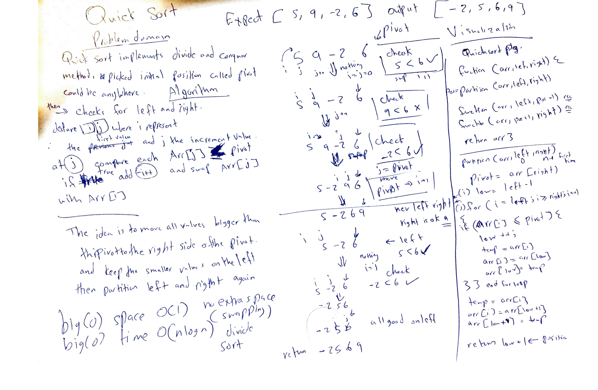

# Quick Sort 
Sorting algorithm that is much faster that insertion sort.

# Class-28
## Challenge Description
Quick Sort, like merge sort at principle of division, at first sight it is obvious that the space complexity is O(1) since no storage happens and swapping is localized but with similar time complexity of O(nlogn) due to the principle. 

Action happens once a pivot number is found, that pivot has all left numbers to be smaller and right numbers to be larger by swapping that number into the middle, then quick sort again for each left and right recursively until all pivots represent the numbers from lowest left to highest right.

## Solution
