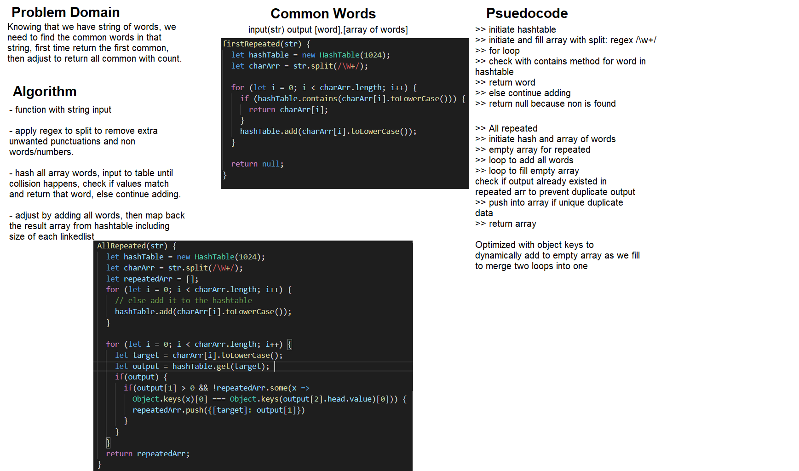

# Repeated Words Detector
With an input of a string, get the first repeated word out.

# Class-31
## Repeated Words

## Challenge Summary
Find the first repeated word in a book.

Extra: Modify your function to return a count of each of the words in the provided string.
Extra: Modify your function to return a list of the words most frequently used in the provided string.

## Challenge Description
Using a hashtable, the string will be chopped and inputted into, with duplicated automatically detected and returned.

## Approach & Efficiency
Getting the string transformed using a split with regex of valid character input to discard apostrophes and such. Then each word is hashed and is inputted into the bucket, and then if the bucket already exists, it should recheck the value in case if there was collision using contain() LL method.

The efficiency of this simple solution is a O(n) for both time and space, since array as a whole needs to be inputted, and worst case involves no or last word repeated. Space since hashtables require at worst O(n) storage to do its job.

Extra first modification of function would involves adding a size to the bucket, add it once repeated are found and return at the end all buckets with value.

The last second modification requires a sort to be implemented at the end just before the result return, which could be implemented with a sort.

## Solution
