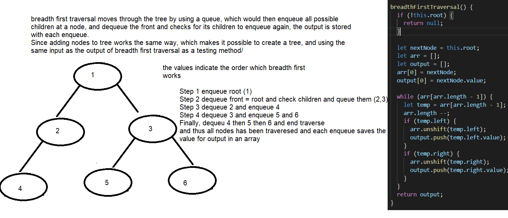
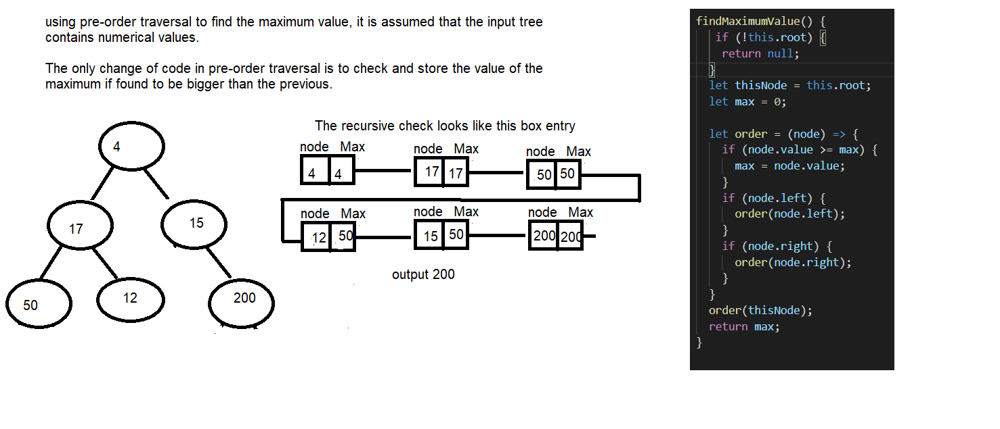

# Tree data structure class
Tree has been investigated, and found to have some fruitful results and savory outcomes in terms of in depth understanding and possible implementations.

# Binary Tree
A binary tree is a special case of tree data structure, it starts similarly with a root node, but each node could only have 2 children called left and right.

## **Class-17**
### Challenge
Breadth-first Traversal method to order values found inside a binary tree.

### Approach & Efficiency
Breadth-first traversal was used before as a way to evenly add nodes, but now is going to be used to arrange nodes as found using that traversal by adding them into an array and return that array.

- **O(n)** time and **O(n)** space complexity since it only includes a traversal of the node and stores an array to return.

### Solution 


## **Class-16**
### Challenge
Adding the Maximum Value method to the binary tree,

### Approach & Efficiency
The method `maximumValue()` is very similar to the contains method, but instead of direct comparison it looks for any greater value than the previous greater value starting from the root value as the greatest initial value. 

- **O(n)** time and **O(1)** space complexity since it only includes a traversal of the node and stores one variable to compare with.

### Solution 


## **Class-15**
### Challenge
Implementing adding and contain methods for a typical binary tree, along with `pre-order`, `in-order` and `post-order` traversals.


### Approach & Efficiency
The method `add()` uses a similar method of breadth first traversal to fill all nodes at a certain depth, starting at the root and filling left to right nodes as it sees empty, the process involves a queue to enqueue all possible left and right nodes, then dequeue one node at a time filling them with a value left then right, first in first out approach allows for balanced filling. 

- **O(1)** time complexity because available nodes are directly entered from the queue that indicated empty spots and **O(n)** space complexity since a queue has to store all possible empty slots.

Traversal using the three methods `pre-order`, `in-order` and `post-order` are quite similar in nature, seeing that they only depend on when to save the root value which is your recursive input into the same method with each step. All three starts looking at the **left** then **right** node, but the push into the returned array happens at first before the left search, or mid in between, or at the end of the recursive function respectively.

Contains method would use one of the  to find each node, and compare it with an input value to eventually get a similar.
- **O(n)** time and **O(1)** space complexity since it only includes a traversal of the node and stores one variable to compare with.

# API's
```
Tree {
  add(); // adds new input in a balanced manner, each level filled from left to right.
  contains(value);  // looks up the value within the tree and returns true if found once.
  findMaximum(); // traverses the whole tree to find the maximum value(int)
  breadthFirst();  // uses the specified tree and returns an array of values encountered with breadth first traversal method
}
```
