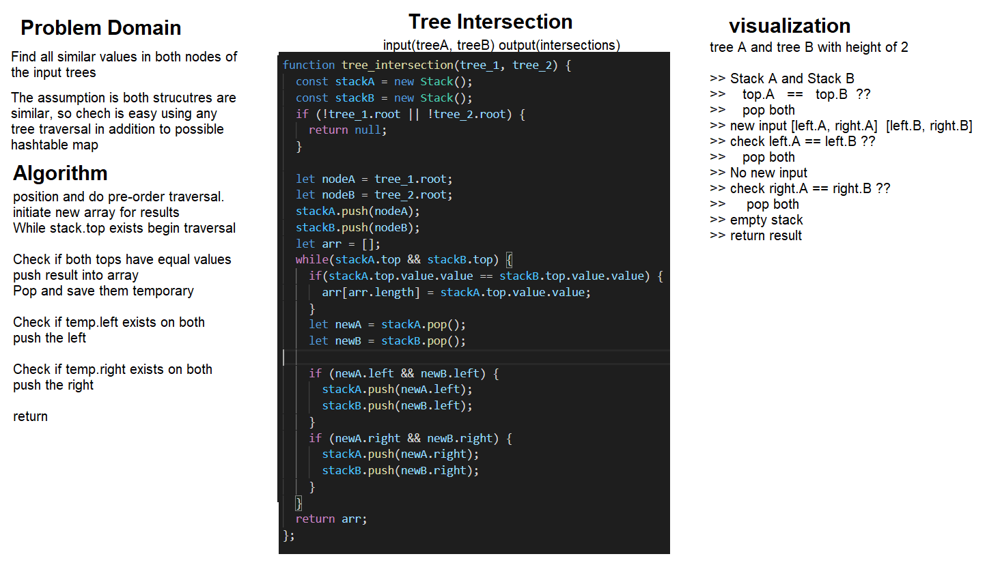

# Tree intersection case study
Using two binary trees, find all common values.

# Class-32
# Binary tree intersections
By requirement the binary trees would have their values laid out, and compared using the hashtable.

## Challenge
Using the hashtable, its possible to do a preOrder with one tree, into the hashtable instead of an array, and check if it already exists when doing the second preOrder.

## Approach & Efficiency
Hashtables allow for quick regulation of repeated values, when done with the first first preOrder, a check starts by doing a similar preOrder, but instead of insertion it does a comparison of existing values in a bucket, and returns that value in an array if it already exists.

This approach assumes two structurally similar binary trees, and uses only ***one*** loop to go through each tree once, and the detection works instantly. this allows for **time complexity** on average, best and worst to be O(n). **Space complexity** on worst also requires O(n) assuming all values are in both trees are identical, since an array is used to store identical values.

The assumption at work however, uses a stack to do pre-order traversal, and check at once, this method is similar to hashtables if check is done at the same time of insertion, but cannot accommodate different binary structure or value positioning.

## API
